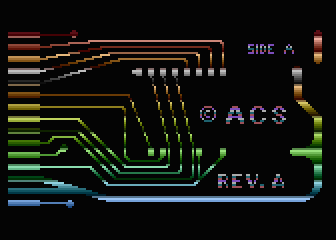
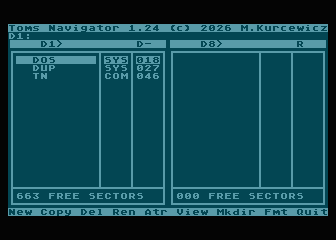

# actionc

[](https://github.com/mkur/actionc/actions/workflows/ci.yml)

`actionc` is a Rust cross-compiler for the Atari 8-bit Action! language. It
compiles Action! source code on a modern computer into Atari load-format
executables, with a compatibility-oriented path for original programs and an
optimized path for maintained code.

The project is under active development. The compatibility and optimized modes
are the primary ways to build runnable programs; the newer MIR6502 mode is
available for experimentation and compiler validation.

## Current status

The user-facing compiler offers three build modes:

| Mode | Purpose | Status |
|---|---|---|
| `compatibility` | Compile original Action! sources conservatively | Default |
| `optimized` | Produce smaller code from maintained or modernized sources | Recommended for maintained code |
| `mir6502` | Exercise the new SemIR → NIR → MIR6502 pipeline | Experimental |

`actionc` is not a byte-for-byte clone of the original cartridge compiler.
Compatibility work focuses on source behavior, public ABI conventions, storage
layout, and running real programs correctly.

## Quick start

You need a recent stable Rust toolchain with Cargo. From a clone of this
repository, install the user-facing compiler:

```sh
cargo install --path . --bin actionc
```

Compile the minimal [Hello World](samples/hello-world.act) sample and generate
a source-annotated 6502 listing at the same time:

```sh
actionc samples/hello-world.act \
  --output build/hello-world.com \
  --listing build/hello-world.lst
```

`actionc` creates missing output directories. If `--output` is omitted, it
writes `<source-stem>.com` in the current directory.

The `.com` file is an Atari load-format executable. The optional `.lst` file
shows generated bytes and 6502 instructions alongside the Action! source that
produced them.

## Run it on an Atari emulator

Install the cross-platform runner:

```sh
cargo install --path . --bin actionc-run
```

It compiles the source, creates a bootable MyDOS ATR in memory, and starts
Atari800 or Altirra with the bundled Action! cartridge:

```sh
actionc-run samples/hello-world.act
```

On Windows, automatic discovery prefers Altirra and falls back to Atari800. On
Linux and macOS it uses Atari800. Use `--no-run --out-atr <file>` to create the
ATR without launching an emulator.

See [Running programs with actionc-run](docs/ACTIONC_RUN.md) for emulator
discovery, cartridge overrides, retained artifacts, and the complete runner
interface. The older `tools/compile-run-atr.sh` remains available for advanced
custom-ATR and compiler-development workflows.

## What it supports

- Atari load-format object generation and source-annotated 6502 listings;
- the original Action! source style used by historical programs;
- explicit casts, address values, typed function pointers, and other documented
  syntax extensions;
- compatibility, optimized, and experimental MIR6502 build modes;
- classic AST-based code generation and the experimental MIR6502 pipeline;
- source annotations that select a default profile or backend;
- inspection of tokens, SemIR, NIR, MIR6502, maps, proofs, and raw generated
  output through `actionc-emit`.

The maintained samples include small graphics programs, the Action! Toolkit,
and TOMS Navigator. These larger programs are also used for compatibility and
runtime regression testing.

## Choosing a mode

The default `compatibility` mode is intended for old Action! source code:

```sh
actionc PROGRAM.ACT \
  --mode compatibility \
  --output build/PROGRAM.COM
```

For maintained source where smaller output is preferred, use `optimized` mode:

```sh
actionc PROGRAM.ACT \
  --mode optimized \
  --output build/PROGRAM.COM
```

Use `mir6502` mode for the experimental compiler pipeline:

```sh
actionc PROGRAM.ACT \
  --mode mir6502 \
  --output build/PROGRAM-MIR.COM
```

Modes select the appropriate lower-level compiler profile and backend. Advanced
users can still select those components directly instead of using `--mode`.
The detailed rules and source-level differences are documented in
[Code-generation profiles](docs/CODEGEN_PROFILES.md) and
[Syntax extensions](docs/SYNTAX_EXTENSIONS.md).

## Samples

- [Hello World](samples/hello-world.act) — minimal text output;
- [Inline-assembler fine scroller](samples/inline-asm-fine-scroll.act) — a
  static screen-code buffer and custom ANTIC display list driven by an
  immediate vertical-blank routine;
- [Atari Fuji logo](samples/atari-fuji-logo.act) — graphics and drawing calls;
- [Logo](samples/logo.act) and [Rainbow](samples/rainbow.act) — historical
  graphics examples; [Rainbow ASM](samples/rainbow_asm.act) shows the raster
  effect rewritten with inline assembly;
- [Action! Toolkit](samples/toolkit/README.md) — maintained modernized Toolkit
  programs;
- [TOMS Navigator](samples/tn/README.md) — a large real-world Action! program.

| [ACS Logo](samples/logo.act) | [Kalscope](samples/toolkit/modern/KALSCOPE.DEM) | [TOMS Navigator](samples/tn/modern/TN.ACT) |
|:---:|:---:|:---:|
|  |  |  |

Original disk material and byte-exact source extractions live under `corpora/`.
Maintained, user-facing source belongs under `samples/`.

## Inspect compiler output

`actionc-emit` preserves the developer-facing, stdout-oriented interface for
compiler representations and raw artifacts:

```sh
cargo run --quiet --bin actionc-emit -- \
  --emit-nir samples/hello-world.act

cargo run --quiet --bin actionc-emit -- \
  --emit-optimized-nir samples/hello-world.act

cargo run --quiet --bin actionc-emit -- \
  --profile modern \
  --backend mir6502 \
  --emit-source-listing samples/hello-world.act
```

Install it separately when you want to use it outside the repository:

```sh
cargo install --path . --bin actionc-emit
```

## Documentation

- [Command-line usage](USAGE.md)
- [Running programs with actionc-run](docs/ACTIONC_RUN.md)
- [Documentation index](docs/README.md)
- [Code-generation profiles](docs/CODEGEN_PROFILES.md)
- [Syntax extensions](docs/SYNTAX_EXTENSIONS.md)
- [Action! storage layout](docs/ACTION_STORAGE_LAYOUT.md)
- [Resident library notes](docs/resident_library.md)

## Development

Run the complete Rust test suite with:

```sh
cargo test
```

The main repository areas are:

```text
src/        compiler, code generators, and command-line entry points
tests/      integration and regression tests
fixtures/   focused compiler inputs and checked snapshots
samples/    maintained user-facing Action! programs
corpora/    archived disks, original sources, and raw comparison material
surveys/    compatibility sweeps, VM captures, and investigation reports
docs/       current reference documentation and archived implementation notes
tools/      local build, comparison, ATR, and emulator helpers
```

## License

Copyright (C) 2026 Michal Kurcewicz

The `actionc` compiler and original supporting code in this repository are
free software licensed under the [GNU General Public License, version 3 or any
later version](LICENSE).

The license of the compiler does not, by itself, apply to programs compiled
with `actionc`. Generated programs remain subject to the licenses of their
source code and any runtime or other material included in them.

Third-party and historical material retains its own licensing terms. In
particular, the bundled Action! 3.6 cartridge is available under
[GPL version 3 or later](roms/ACTION-ROM-NOTICE.md), the bundled MyDOS 4.53/3
image is covered by its [historical distribution terms](atr/MYDOS-NOTICE.md),
and the bundled AltirraOS image is covered by its
[file-specific permissive license](roms/ALTIRRAOS-LICENSE); ROM provenance and
licensing notes are recorded in [roms/README.md](roms/README.md). Material under
`corpora/` is not relicensed by the `actionc` license.
